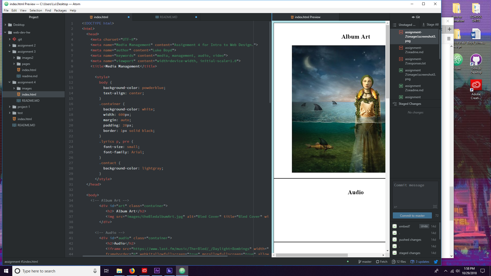

<h1> Assignment 4 Read Me </h1>

<b>A)</b> Divisions are generic containers that divide content.

Classes are used to define equal styles for elements with the same class name

Id specifies a unique Id for an HTML element.

Span is like div, used for grouping, although it functions as an inline element instead of for block elements.

<b>B)</b> Alt text or tags are used to indicate what an image is. This is important for web-users who are not able to see images on your page.

<b>C)</b> This work cycle was very frustrating for me. I had a very difficult time trying to make everything work together. I was unable to find an audio track for this assignment, and I didn't want to upload my version to the net for fear of copyright infringement, so we will just see how things go.

