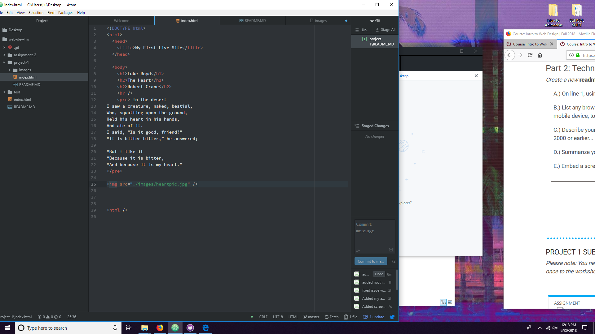

<h1>READ ME<h1 />

<h4> This week we started to work with HTML. I used Firefox as my browser, although I switched back and forth between Firefox and Chrome just to make sure my page worked. A browser functions by reading all elements on the page and displaying them properly for users.

 For the Wayback machine, I visited U of M's website from 1999. It was ugly as hell, and seemed to have a fraction of the current website's functionality. I am very glad that I do not have to use that site for anything. 

 This week was not very difficult, as it was mostly following directions and making sure that all my page elements were in the correct place. I can see how a typo can completely brick someone's code, and it terrifies me. I had one issue where my page would not display properly, but it was fixed with a push to GitHub. I am curious to see what people chose for their poems.

